# Sales Analytics with SQL (and Python)

This project explores sales, customer, and employee performance using SQL queries on the Northwind dataset.

---

## Notes
- SQL: Querying, aggregations, joins, window functions  
- Python: numpy, pandas, matplotlib, networkx  
- Dataset: Northwind sample database

---

## Objective  
I wanted to extract insights from sales data to answer some business questions:  
- Which products and categories drive the most revenue?  
- Who are the top customers and employees?  
- How do monthly orders and revenue trend over time?  
- Which products are frequently purchased together (market basket analysis)?  

---

## Features  
- SQL-based analysis with queries stored in `/sql/`  
- Python integration for exporting results and building visualizations  
- Key Performance Indicators covered:  
  - Product performance (units sold, revenue, share)  
  - Customer and employee contributions  
  - Monthly sales trends  
  - Product associations (Apriori-style market basket analysis)  
- Data visualization with matplotlib and networkx  

---

## Key insights (with visuals) 

### Product performance  
Top 10 products by units sold vs revenue:  

  
  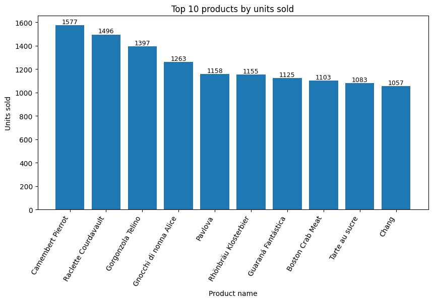  
  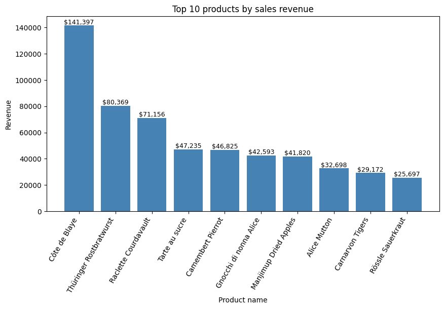  

  

Revenue share of top 10 products vs others:  

  
  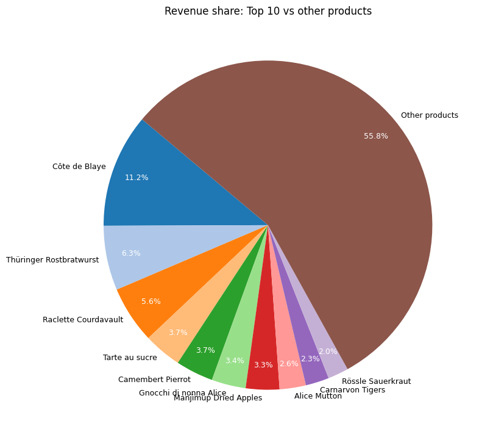  

  

---

### Trends over time  
Monthly orders and revenue evolution:  

  
  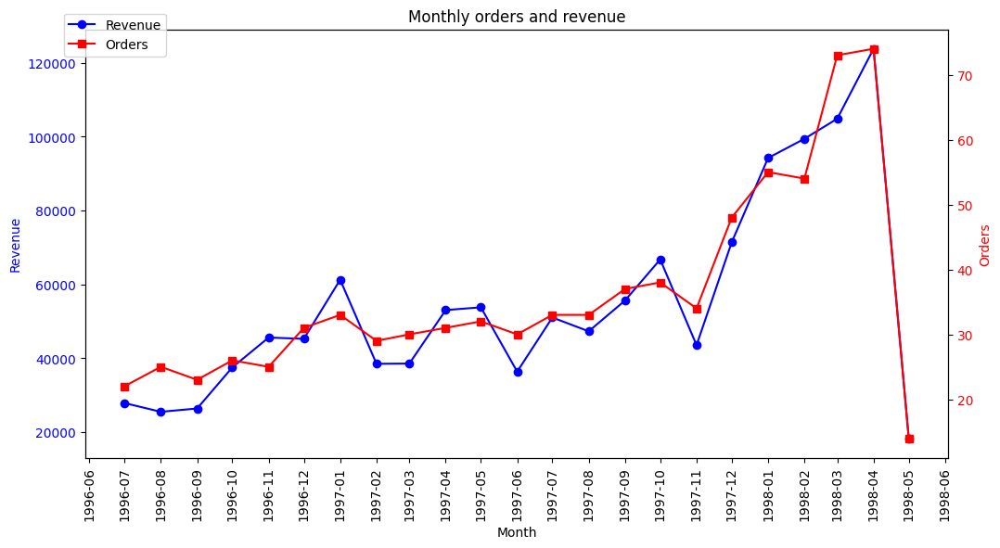  

  

---

### Category analysis  
Revenue contribution by product category:  

  
  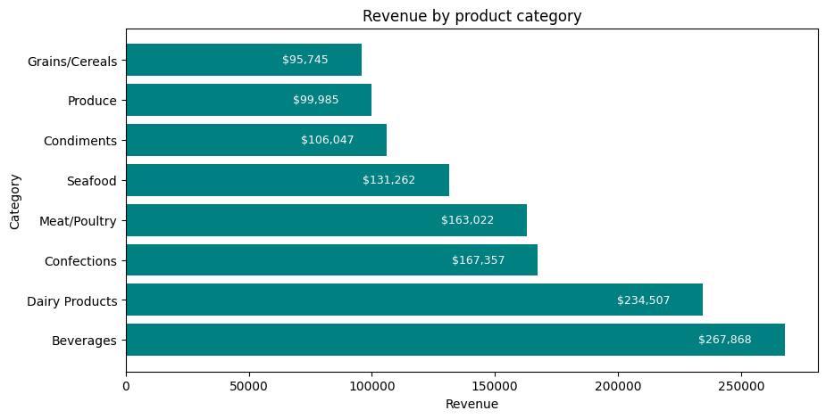  
  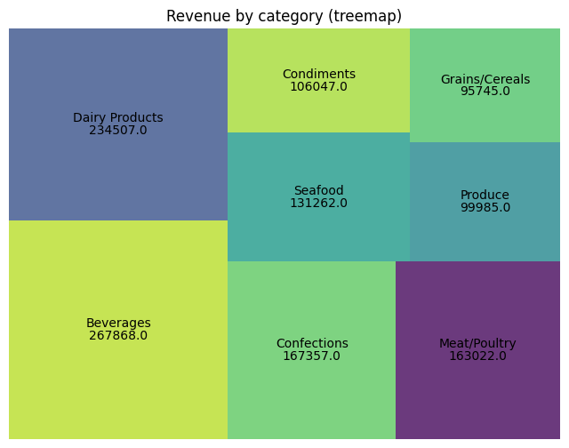  

  

---

### Customers  
Top 10 customers by revenue and their revenue share:  

  
  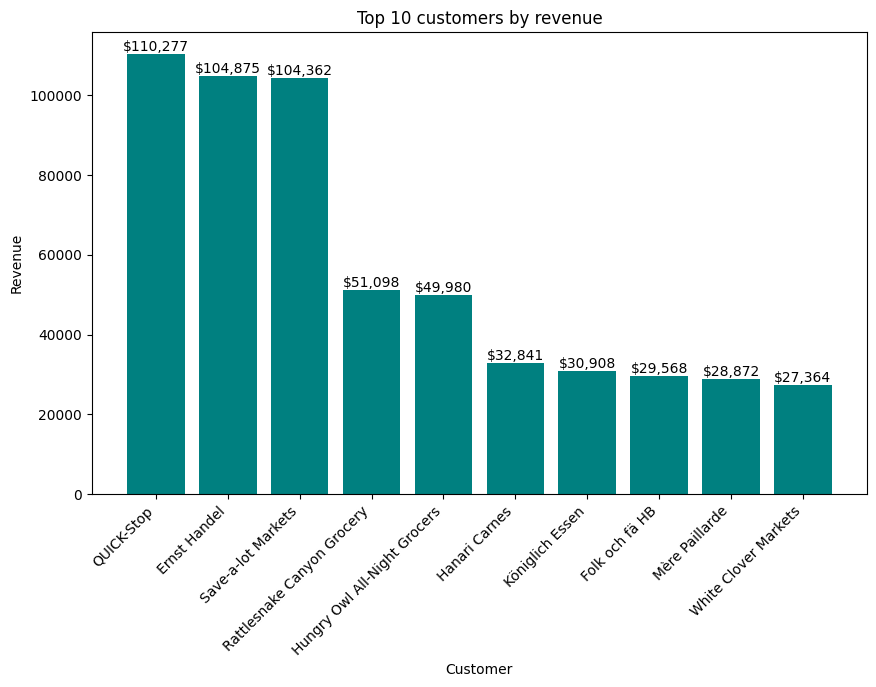  
  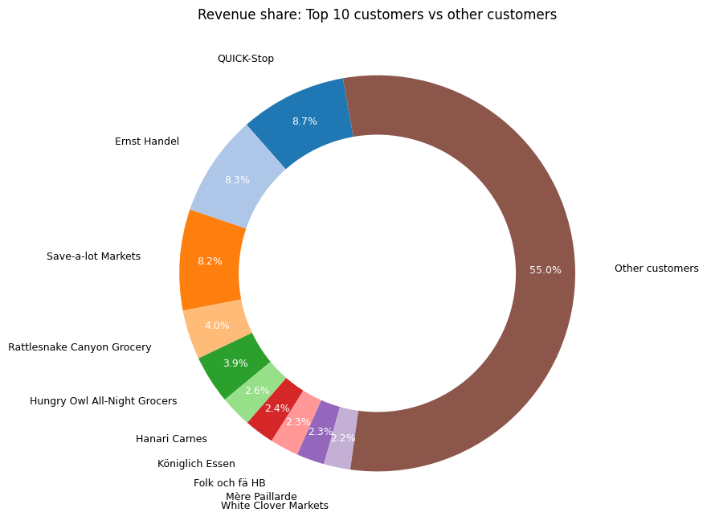  

  

---

### Employees  
Employee performance by revenue and orders:  

  
  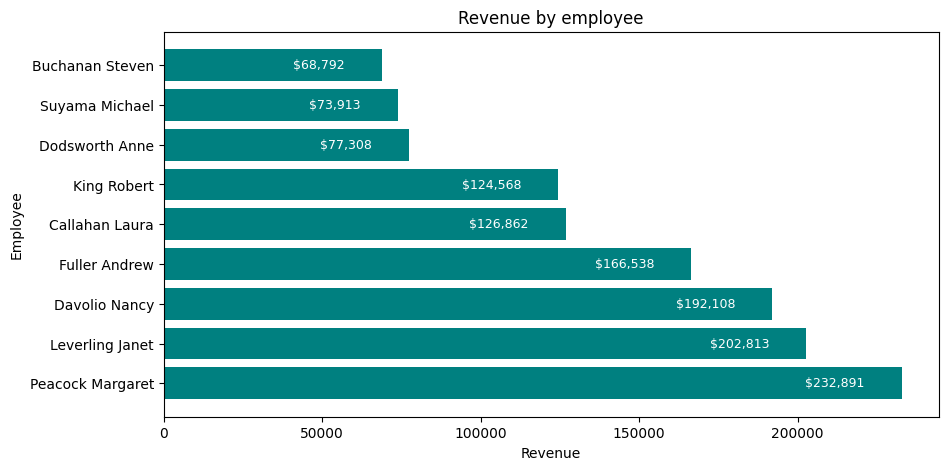  
  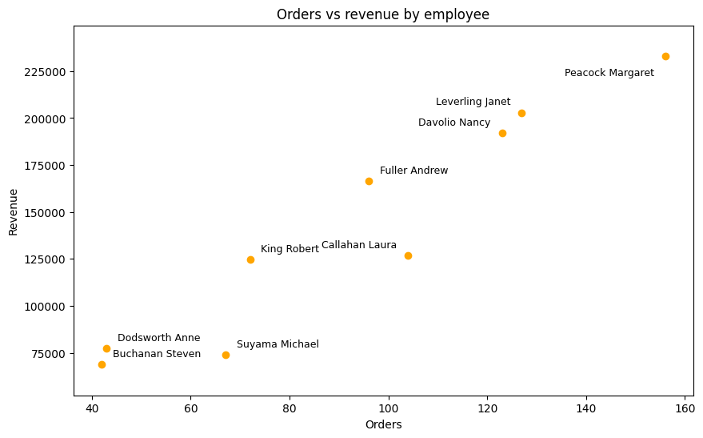  

  

Average order value per employee (with median benchmark):  

  
  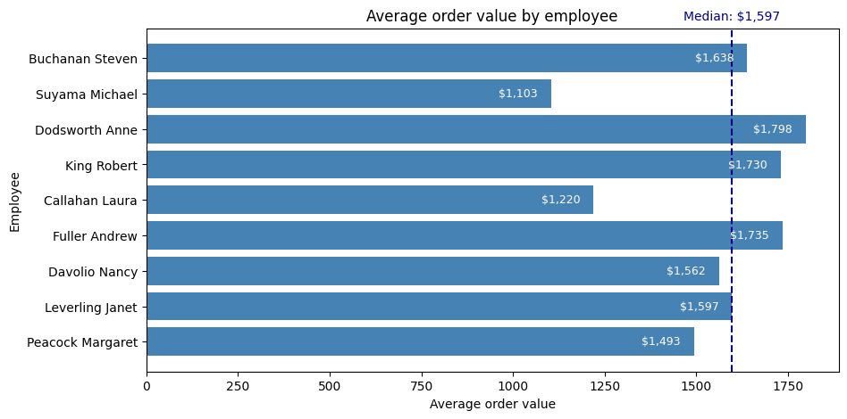  

  

---

### Market Basket Analysis  
Product associations revealed via Apriori-style analysis:  

- **Network of top product pairs**  

  
  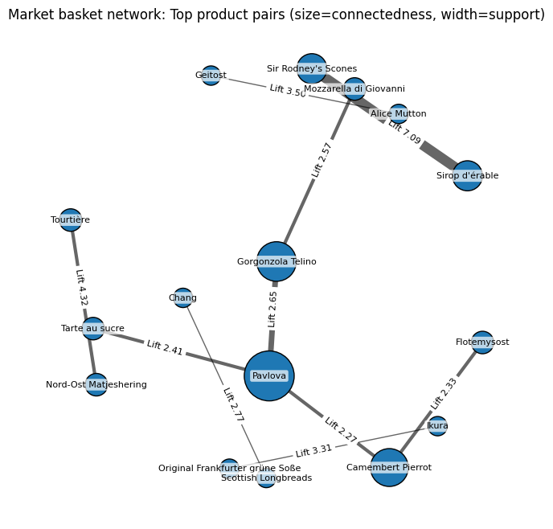  

  

- **Lift heatmap**  

  
  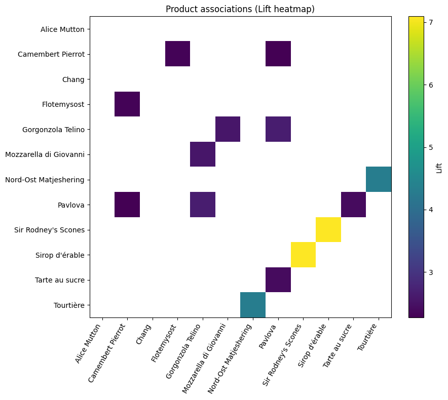  

  

- **Support vs Lift (bubble plot)**  

  
  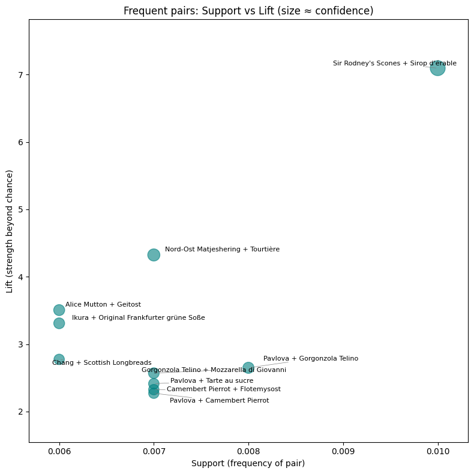  

  

 
